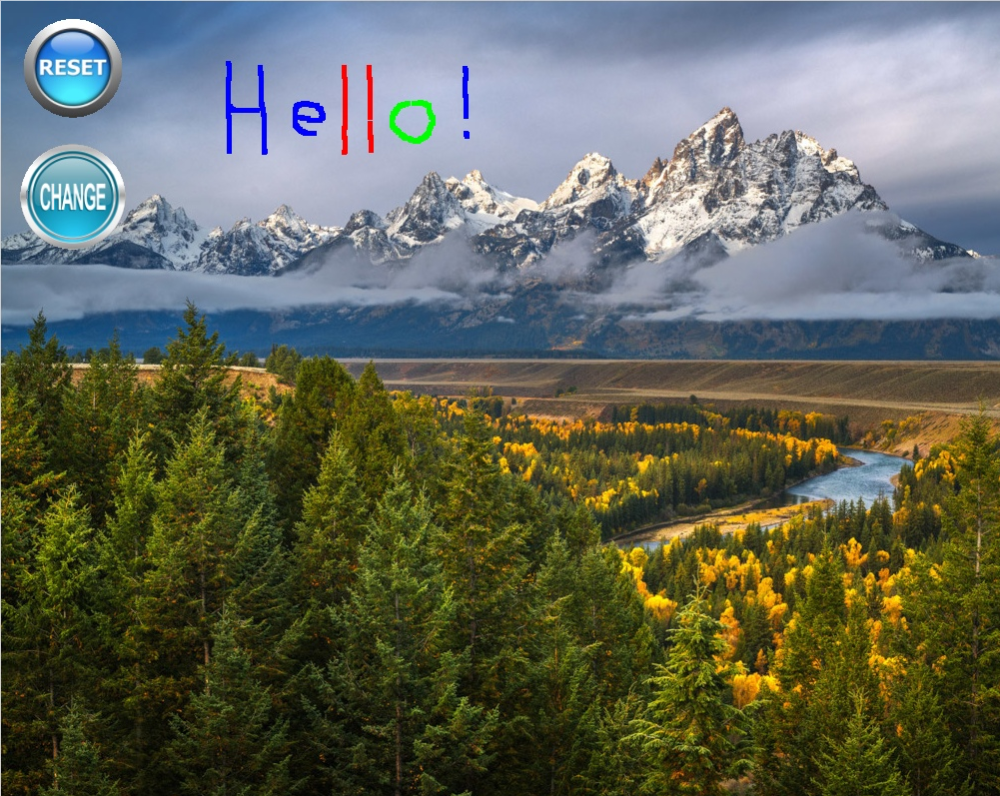

# GPU Image Editor



A high-performance real-time image editing application built with OpenGL and C++, leveraging GPU acceleration for smooth image manipulation and drawing operations.

## 🚀 Project Overview

This GPU Image Editor is a desktop application that provides real-time image editing capabilities with hardware-accelerated rendering. Built using modern OpenGL and C++ with object-oriented design principles, it demonstrates efficient GPU utilization for image processing tasks.

## ⚠️ System Requirements

### Hardware Requirements
- **GPU Support**: A dedicated graphics card with OpenGL 3.3+ support is **REQUIRED**
- **Graphics Drivers**: Up-to-date graphics drivers must be installed
- **Memory**: Minimum 4GB RAM (8GB+ recommended for large images)
- **Storage**: ~50MB for the application and dependencies

### Software Dependencies
- **OpenGL 3.3+**: Core graphics library for GPU acceleration
- **GLFW 3.3+**: Window management and input handling
- **GLAD**: OpenGL function loader
- **STB Image**: Image loading library
- **CMake 3.3+** or **GCC/G++** with C++11 support

### Platform Support
- **Linux**: Full support (tested on Ubuntu 20.04+)
- **macOS**: Supported with Xcode Command Line Tools
- **Windows**: Supported with Visual Studio or MinGW

## 📁 Project Architecture

### Core Components

```
GPU_Image_Editor/
├── src/                    # Source code implementation
│   ├── main.cpp           # Application entry point
│   ├── Application.cpp    # Main application controller
│   ├── Window.cpp         # OpenGL window management
│   ├── Image.cpp          # Image data handling
│   ├── Texture.cpp        # GPU texture management
│   ├── ShaderProgram.cpp  # OpenGL shader management
│   ├── TexturedRectangle.cpp # GPU-rendered rectangles
│   ├── Button.cpp         # Interactive UI buttons
│   └── ColorButton.cpp    # Color selection functionality
├── include/               # Header files
│   ├── Application.h      # Application interface
│   ├── Window.h          # Window management
│   ├── Image.h           # Image processing
│   ├── Texture.h         # GPU texture operations
│   ├── ShaderProgram.h   # Shader management
│   ├── TexturedRectangle.h # GPU rendering
│   ├── Button.h          # UI button interface
│   └── ColorButton.h     # Color selection interface
├── lib/                   # External libraries
│   ├── glad/             # OpenGL function loader
│   └── stb_image.h       # Image loading utilities
├── CMakeLists.txt        # CMake build configuration
├── Makefile             # Manual build configuration
└── *.png                # UI assets and sample images
```

## 🎨 Features

### Core Functionality
- **Real-time Drawing**: GPU-accelerated pixel drawing with customizable colors
- **Image Loading**: Support for common image formats (PNG, JPEG, etc.)
- **Interactive UI**: Mouse-driven interface with button interactions
- **Color Palette**: Dynamic color switching (Blue, Red, Green)
- **Reset Functionality**: Instant image restoration to original state

### GPU-Accelerated Operations
- **Hardware Rendering**: All drawing operations utilize GPU acceleration
- **Texture Management**: Efficient GPU memory management for images
- **Shader-based Rendering**: Custom OpenGL shaders for optimal performance
- **Real-time Updates**: Immediate visual feedback for all operations

### Technical Highlights
- **Object-Oriented Design**: Clean separation of concerns with single responsibility principle
- **Memory Management**: Proper C++ memory handling with RAII principles
- **Cross-platform Compatibility**: Works on Linux, macOS, and Windows
- **Performance Optimized**: Leverages GPU parallel processing capabilities

## 🛠️ Installation & Setup

### Prerequisites Installation

#### Ubuntu/Debian
```bash
# Install OpenGL development libraries
sudo apt update
sudo apt install libgl1-mesa-dev libglfw3-dev libglu1-mesa-dev

# Install build tools
sudo apt install build-essential cmake
```

#### macOS
```bash
# Install Xcode Command Line Tools
xcode-select --install

# Install GLFW via Homebrew
brew install glfw
```

#### Windows
- Install Visual Studio 2019+ with C++ development tools
- Download and install GLFW from: https://www.glfw.org/download.html
- Ensure OpenGL drivers are up to date

### Building the Project

#### Using CMake (Recommended)
```bash
# Clone the repository
git clone <repository-url>
cd GPU_Image_Editor

# Create build directory
mkdir build && cd build

# Configure and build
cmake ..
make

# Run the application
./ImageEditor
```

#### Using Makefile
```bash
# Build the project
make

# Run the application
./build/ImageEditor
```

## 🎮 Usage

### Getting Started
1. **Launch the Application**: Run the compiled executable
2. **Load an Image**: The application loads a default background image
3. **Start Drawing**: Click and drag with the mouse to draw on the image
4. **Change Colors**: Click the color button to cycle through Blue → Red → Green
5. **Reset Image**: Click the reset button to restore the original image
6. **Exit**: Press ESC key to close the application

### Controls
- **Mouse Drag**: Draw on the image
- **Color Button**: Cycle through available colors
- **Reset Button**: Restore original image
- **ESC Key**: Exit application

## 🔧 Technical Implementation

### GPU Acceleration Details
- **OpenGL Context**: Modern OpenGL 3.3+ core profile
- **Vertex Buffer Objects (VBOs)**: Efficient GPU memory management
- **Texture Objects**: Hardware-accelerated image storage and manipulation
- **Shader Programs**: Custom vertex and fragment shaders for rendering
- **Frame Buffer Operations**: Real-time image updates

### Performance Optimizations
- **Batch Rendering**: Multiple operations combined for efficiency
- **GPU Memory Management**: Optimal texture allocation and deallocation
- **Minimal CPU-GPU Transfers**: Reduced data movement between CPU and GPU
- **Hardware Acceleration**: Leverages GPU parallel processing for drawing operations

### Architecture Patterns
- **Single Responsibility Principle**: Each class handles one specific concern
- **RAII Memory Management**: Automatic resource cleanup
- **Observer Pattern**: Event-driven UI interactions
- **Factory Pattern**: Object creation and initialization

## 🚀 Performance Characteristics

### GPU Utilization
- **Parallel Processing**: Drawing operations utilize GPU cores
- **Memory Bandwidth**: Efficient use of GPU memory hierarchy
- **Shader Execution**: Custom shaders optimize rendering pipeline
- **Real-time Performance**: 60+ FPS rendering on modern GPUs

### System Requirements Verification
```bash
# Check OpenGL version
glxinfo | grep "OpenGL version"

# Verify GPU support
lspci | grep VGA

# Test OpenGL functionality
glxgears
```

## 🛡️ Troubleshooting

### Common Issues

#### "OpenGL not found" Error
- **Solution**: Install OpenGL development libraries
- **Linux**: `sudo apt install libgl1-mesa-dev`
- **macOS**: Update graphics drivers
- **Windows**: Update GPU drivers

#### "GLFW not found" Error
- **Solution**: Install GLFW development libraries
- **Linux**: `sudo apt install libglfw3-dev`
- **macOS**: `brew install glfw`
- **Windows**: Download from GLFW website

#### Poor Performance
- **Check GPU**: Ensure dedicated graphics card is being used
- **Update Drivers**: Install latest graphics drivers
- **Close Background Apps**: Free up GPU resources

#### Build Errors
- **Compiler Version**: Ensure C++11 support
- **Library Paths**: Verify include and library directories
- **Dependencies**: Check all required libraries are installed

## 📊 System Compatibility

### Tested Configurations
- **Ubuntu 20.04+**: Full support with NVIDIA/AMD GPUs
- **macOS 10.15+**: Compatible with Intel/AMD GPUs
- **Windows 10/11**: Works with DirectX-compatible GPUs

### GPU Requirements
- **Minimum**: OpenGL 3.3 support
- **Recommended**: OpenGL 4.0+ with dedicated VRAM
- **Optimal**: Modern GPU with 2GB+ VRAM

## 🔮 Future Enhancements

### Planned Features
- **Advanced Filters**: Blur, sharpen, edge detection
- **Layer System**: Multiple image layers
- **File I/O**: Save/load edited images
- **Undo/Redo**: Operation history
- **Brush Tools**: Different brush sizes and shapes
- **Color Picker**: Custom color selection

### Performance Improvements
- **Compute Shaders**: GPU-accelerated image processing
- **Multi-threading**: CPU-GPU parallel processing
- **Memory Optimization**: Reduced GPU memory usage
- **Batch Operations**: Multiple operations in single GPU call

## 📄 License

This project is developed as a personal portfolio piece demonstrating GPU programming and real-time graphics capabilities.

## 🤝 Contributing

This is a personal project showcasing GPU programming skills. For questions or suggestions, please open an issue or contact the developer.

---

**Note**: This application requires a GPU with OpenGL support. Software rendering is not supported due to performance requirements. Ensure your system meets the hardware requirements before attempting to run the application.